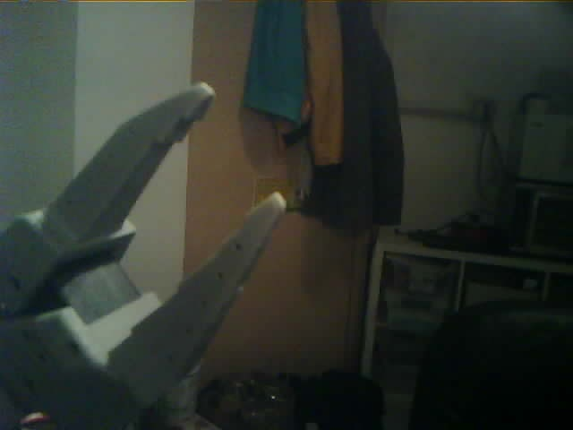

# ESP32-S3 USB Webcam

Firmware for making a Seeed XIAO ESP32S3 Sense enumerate as a real USB Video
Class webcam. The host sees it as a normal UVC camera, not as a Wi-Fi stream,
access point, HTTP endpoint, or vendor-specific serial device.



## Hardware

- Seeed Studio XIAO ESP32S3 Sense
- The matching OV2640 camera module
- USB-C cable that carries data
- Linux host with V4L2 for the verification steps below

Other ESP32 boards are not expected to work unchanged. The firmware depends on
native USB support, PSRAM, and the camera pinout in `main/camera_pin.h`.

## Build

Install PlatformIO Core, then run:

```bash
pio run
```

This project intentionally pins `platform = espressif32@6.9.0`, which uses
ESP-IDF 5.3.x. Newer ESP-IDF 6 based PlatformIO packages currently break the
camera dependency used here.

## Flash

Put the board in bootloader mode if needed, then flash. Adjust the upload port
for your machine:

```bash
pio run -t upload --upload-port /dev/ttyACM1
```

After reset, Linux should enumerate the camera:

```bash
lsusb | rg '303a:8000|UVC|Espressif'
ls -l /dev/v4l/by-id/
```

On the verified setup the device appeared as:

```text
303a:8000 Espressif ESP UVC Device
/dev/v4l/by-id/usb-Espressif_ESP_UVC_Device_12345678-video-index0 -> ../../video0
```

## Verify A Frame

```bash
python - <<'PY'
import cv2, os, time

cap = cv2.VideoCapture(0, cv2.CAP_V4L2)
cap.set(cv2.CAP_PROP_FOURCC, cv2.VideoWriter_fourcc(*'MJPG'))
cap.set(cv2.CAP_PROP_FRAME_WIDTH, 640)
cap.set(cv2.CAP_PROP_FRAME_HEIGHT, 480)
time.sleep(1)

ok, frame = cap.read()
print("opened:", cap.isOpened())
print("read:", ok, None if frame is None else frame.shape)
if ok:
    cv2.imwrite('/tmp/esp32-uvc-video0.jpg', frame)
    print("saved:", os.path.getsize('/tmp/esp32-uvc-video0.jpg'), "bytes")
cap.release()
PY
```

The known-good board returned a `640x480` frame and saved a real image from
`/dev/video0`.

## Notes

- This is USB UVC firmware only. There is deliberately no Wi-Fi setup, AP mode,
  web server, stream URL, password, or network discovery path.
- `components/usb_device_uvc` is vendored because the managed component needed a
  small PlatformIO-compatible CMake change.
- Generated PlatformIO and ESP-IDF outputs are ignored. Rebuild from source with
  `pio run`.
- A short build write-up is published as a public gist:
  https://gist.github.com/JacobFV/f36f57def2b0b1446036fef3fa4c1016

## Troubleshooting

- If `lsusb` shows only a serial/JTAG device, reset the board after flashing or
  verify that the UVC firmware actually uploaded.
- If no `/dev/video*` node appears, check `dmesg -w` while plugging in the
  board.
- If build errors mention `driver/ledc.h`, confirm PlatformIO is using
  `espressif32@6.9.0`.
- If CMake reports duplicate `usb_descriptors.c.o` actions, make sure the
  vendored `components/usb_device_uvc/CMakeLists.txt` is used instead of the
  unmodified managed component.
